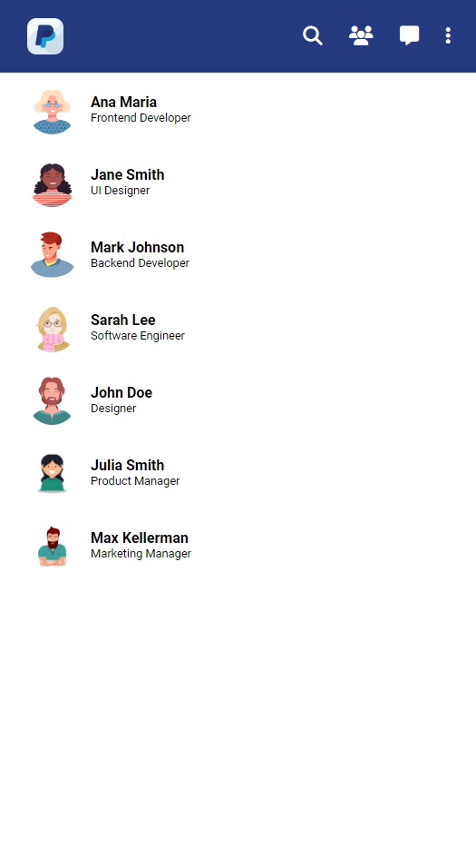
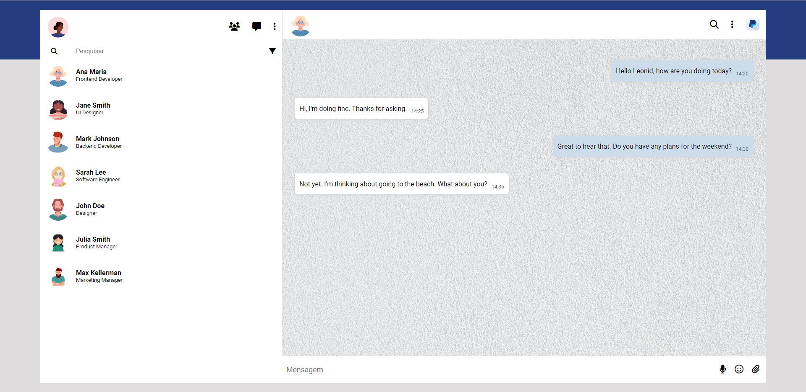
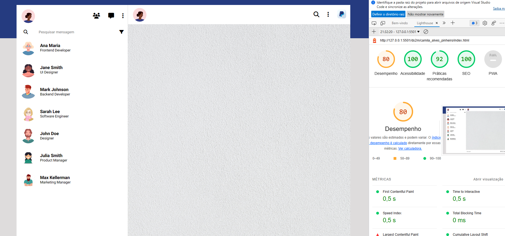

# Clone do WhatsApp - Pay Pal Web

|      MOBILE         |          DESKTOP       |
|:-------------------:|:-----------------------:
|||
|                     |                        |

[Clique aqui](https://camilapinh3iro.github.io/whatsApp-senai-1-2023/ds2m/camila_alves_pinheiro/) para acessar o site. 

---
## Sobre 
Foi proposto à nós que desenvolvessemos a interface do usuário de um projeto de chat interno. Escolhi me inspirar no Pay Pal, uma empresa de pagamentos online.

O objetivo deste projeto é colocar em prática os conhecimentos adquiridos no módulo de PWFE (Programação Web FrontEnd) durante o segundo semestre do curso de Desenvolvimento de Sistemas no [SENAI Jandira](https://jandira.sp.senai.br/). Além disso, incentivar a procura de outras técnicas para implementar no mesmo.

---
## Tecnologias Utilizadas 
- HTML
- CSS
- Markdown
- Responsividade
- JavaScript
- JSON

<!-- --- -->
<!-- ## Relatório LightHouse
O Lighthouse é uma ferramenta automatizada que aprimora a qualidade dos apps da Web, simulando diversas situações que podem afetar a experiência do usuário.

 -->

---
## Autor 
- [Camila Pinheiro](https://github.com/camilapinh3iro)

---
# Critérios de Avaliação
- [x] `Codificou o app conforme o original?`
- [ ] Nomeou as classes CSS utilizando o padrão BEM?
- [x] `O app está responsivo?`
- [ ] Utilizou algum framework CSS?
- [x] `Consumiu o JSON para mostrar todos os contatos?`
- [] Criou outros itens, na lista de contatos, como a quantidade de mensagens lidas?
- [x] `Consumiu o JSON para mostrar as mensagens de cada contato?`
- [x] Foi criado variáveis pensando nas boas praticas?
- [x] `Foi criado funções pensando em responsabilidade única?`
- [x] `Foi criado funções pensando no principio de funções puras?`
- [x] O texto do README é objetivo e sucinto?
- [x] O screenshot mostra um pouco do projeto?
- [x] Existe um link para o github page no README?
- [x] Existe um link do autor do projeto no README?
- [x] `Fez a autoavaliação?`