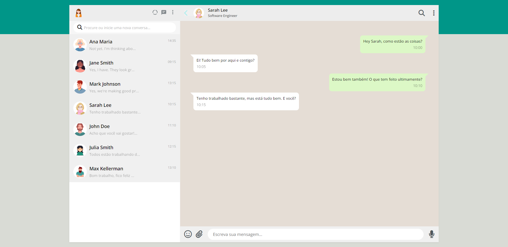

# DS1M - A - Clara Martins Oliveira

# WhatsApp Clone

[Clique aqui](https://oliveiraclara.github.io/whatsApp-senai-1-2023/ds2m/clara_martins_oliveira/) para acessar o site. 

---

## Sobre
Site feito  para desenvolver a interface do usuário de um projeto de chat interno para uma empresa. A empresa decidiu que a interface deverá ser um clone do WhatsApp, pois a grande maioria dos funcionários já está acostumada a utilizá-lo em seu dia a dia.

O objetivo deste projeto é colocar em prática os conhecimentos adquiridos em aula no curso de Desenvolvimento de Sistemas do [SENAI Jandira](https://jandira.sp.senai.br/).

---
## Tecnologias utilizadas
- HTML5
- CSS3
- JS
- JSON
<!-- ---
## Lighthouse
O LightHouse basicamente analisa todo o seu site, indicando como está determinados aspectos do mesmo. 

Segue o relatório:

--- -->

# Critérios de Avaliação
- [x] `Codificou o app conforme o original?`
- [X] Nomeou as classes CSS utilizando o padrão BEM?
- [x] `O app está responsivo?`
- [X] Utilizou algum framework CSS?
- [x] `Consumiu o JSON para mostrar todos os contatos?`
- [ ] Criou outros itens, na lista de contatos, como a quantidade de mensagens lidas?
- [x] `Consumiu o JSON para mostrar as mensagens de cada contato?`
- [x] Foi criado variáveis pensando nas boas praticas?
- [x] `Foi criado funções pensando em responsabilidade única?`
- [x] `Foi criado funções pensando no principio de funções puras?`
- [x] O texto do README é objetivo e sucinto?
- [x] O screenshot mostra um pouco do projeto?
- [x] Existe um link para o github page no README?
- [x] Existe um link do autor do projeto no README?
- [x] `Fez a autoavaliação?`

## Autora
|  |   | |
:----------------------------------------------------------------------------------------------------------------------------------------------------------------------------------------- | :------------------------------------------------------------------------------------------------: | :-------------------------------------------------------------------------------: |
|
|    |  | </a> |
| 