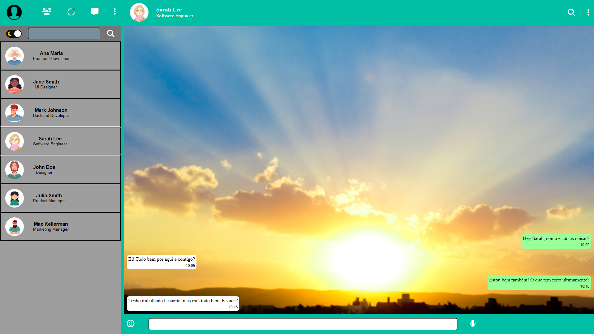

# **Clone WhatsApp**

## [Clique aqui](https://cotilen.github.io/whatsApp-senai-1-2023/ds2m/cleiton_dos_santos_cruz/) para acessar o site

## **SOBRE**

- Site tipo do One Page com a finalidade de divulgação do novo jogo God of War Ragnarok.
- - Esse projeto foi proposto pelo professor de Linguagem de Marcação com objetivo de projetarmos um site clone do Whatsapp para um empresa fictícia seguindo alguns critérios, segue abaixo:

### **TO DO LIST:**

- [X] `Codificou o app conforme o original?`
- [X] Nomeou as classes CSS utilizando o padrão BEM?
- [X] `O app está responsivo?`
- [ ] Utilizou algum framework CSS?
- [X] `Consumiu o JSON para mostrar todos os contatos?`
- [ ] Criou outros itens, na lista de contatos, como a quantidade de mensagens lidas?
- [X] `Consumiu o JSON para mostrar as mensagens de cada contato?`
- [X] Foi criado variáveis pensando nas boas praticas?
- [X] `Foi criado funções pensando em responsabilidade única?`
- [X] `Foi criado funções pensando no principio de funções puras?`
- [X] O texto do README é objetivo e sucinto?
- [X] O screenshot mostra um pouco do projeto?
- [X] Existe um link para o github page no README?
- [X] Existe um link do autor do projeto no README?
- [X] `Fez a autoavaliação?`

## **TECNOLOGIAS APLICADAS**

- HTML5
- CSS3
- JS

## **FERRAMENTAS**

- VSCODE
- GITHUB / GIT
- FONT-AWESOME

## **CONCEITOS APLICADOS**

- @MEDIA
- HOVER
- FILTER
- API

## **AUTOR**

 
