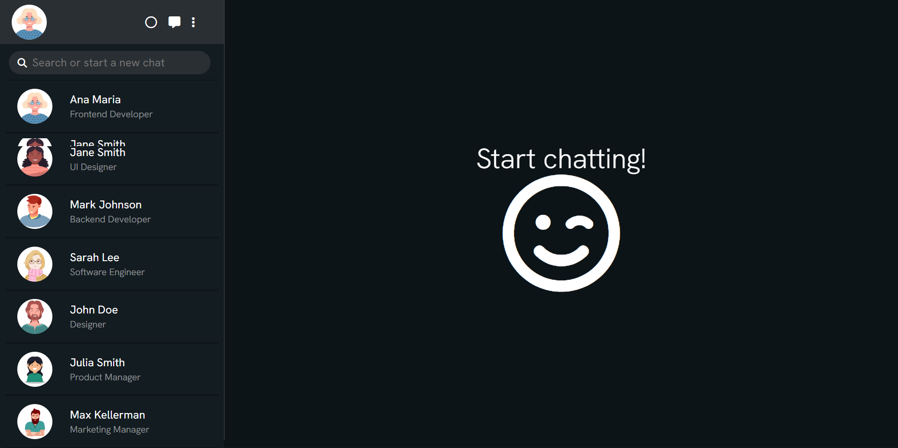
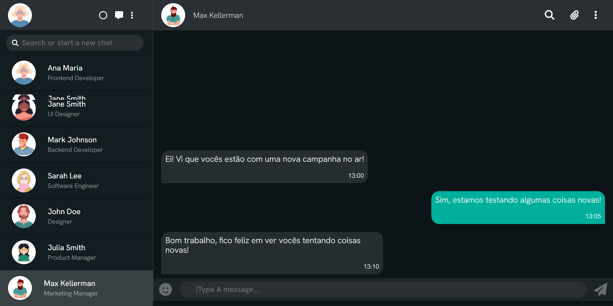

 # Projeto: **WhatsApp** **Web**

Projeto de front-end desenvolvido com base no WhatsApp Web

----

---

---

Link para o [**site**](https://rib3r0.github.io/whatsApp-senai-1-2023/ds2m/eduardo_ribeiro_pimenta/)

## Autoavaliação
---

A principio tudo foi bem tranquilo, tive pouca dificuldade em aprender a utilizar os Array e JSONs, as questões de estrutura do site foram bem simples de serem feitas, principalmente pelo uso do Pure Framework, o que fez eu ficar mais focado com a proposta da atividade que eram a criação de elementos HTML em JS e a Utilização de um JSON para retirada de dados. Me esforcei até em fazer coisas além do necessário para aprender mais e me desafiar ao mesmo tempo, como inserir mensagens ou a responsividade.

## Autor : [Eduardo Ribeiro Pimenta](https://github.com/Rib3r0)