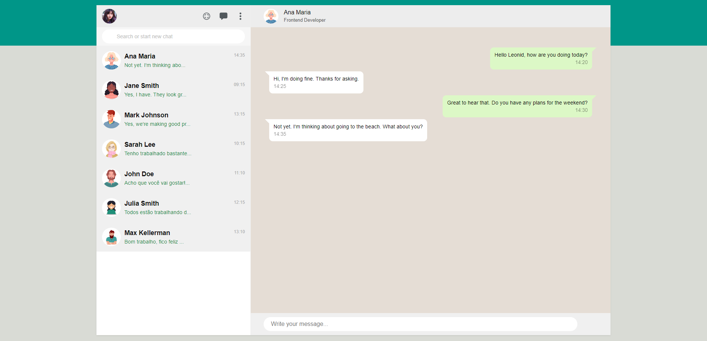
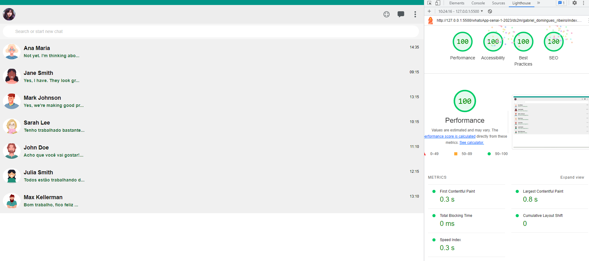

# DS2M - B - Gabriel Domingues Ribeiro

---

# Portifólio

[Clique aqui](https://gabrieldominguesr.github.io/whatsApp-senai-1-2023/ds2m/gabriel_domingues_ribeiro/) para visitar o site.

---

## Sobre 
Site do WhatsApp. O objetivo deste projeto é colocar em prática os conhecimentos adquiridos no curso do [SENAI Jandira](https://jandira.sp.senai.br/) na criação de web sites e adquirir conhecimento sobre outras coisas das quais não foram abordadas no curso.

---
## Tecnologias
- HTML
- CSS
- Responsividade
- JS

--- 
## Relatório do LightHouse
O LightHouse analisa todo o seu site, indicando como está determinados aspectos do mesmo. Segue o relatório:

---
## Equipe
- [Gabriel Domingues](https://fernandoleonid.github.io/whatsApp-senai-1-2023/ds2m/gabriel_domingues_ribeiro)

# Critérios de Avaliação
- [x] `Codificou o app conforme o original?`
- [ ] Nomeou as classes CSS utilizando o padrão BEM?
- [x] `O app está responsivo?`
- [ ] Utilizou algum framework CSS?
- [x] `Consumiu o JSON para mostrar todos os contatos?`
- [x] Criou outros itens, na lista de contatos, como a quantidade de mensagens lidas?
- [x] `Consumiu o JSON para mostrar as mensagens de cada contato?`
- [x] Foi criado variáveis pensando nas boas praticas?
- [x] `Foi criado funções pensando em responsabilidade única?`
- [x] `Foi criado funções pensando no principio de funções puras?`
- [x] O texto do README é objetivo e sucinto?
- [x] O screenshot mostra um pouco do projeto?
- [x] Existe um link para o github page no README?
- [x] Existe um link do autor do projeto no README?
- [x] `Fez a autoavaliação?`
