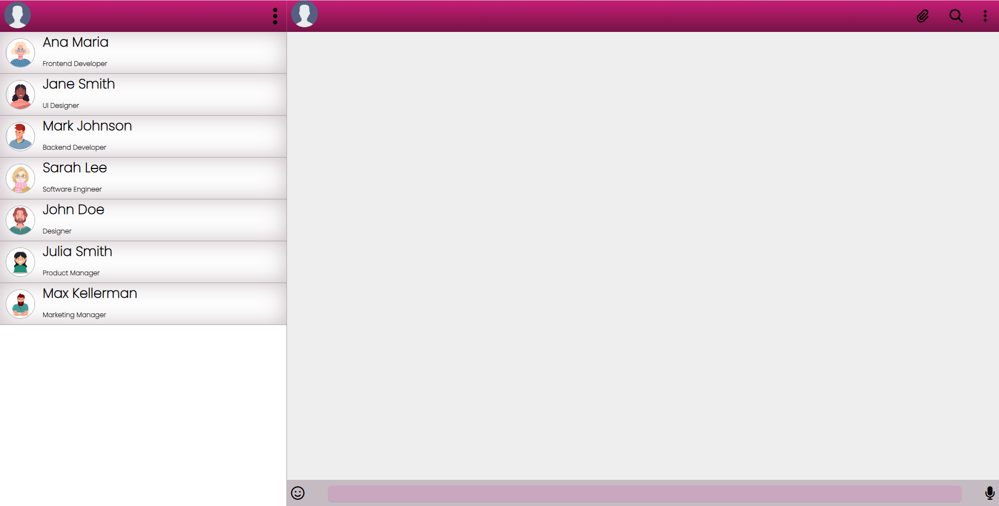

# Página WhatsApp 
### **Página para aplicativo de mensagem de texto**

### Clique **[AQUI](https://genivania.github.io/whatsApp-senai-1-2023/ds2m/genivania_macedo_oliveira/)** para visualizar o site.

# Sobre :

### O objetivo desse projeto é fazer o aluno desenvolver uma pagina com base no WhatsApp, juntamente com as orientações do professor. Apesar de terem alguns requesitos a serem seguidos a página foi desenvolvida conforme a criatividade de cada aluno.

# Ferramentas :

* VSCODE
* GITHUB
* FIGMA
* FONT-AWESOME 

# Tecnologias aplicadas :
* HTML
* CSS
* JS

# Critérios de avaliação :

- [x] `Codificou o app conforme o original?`
- [x] Nomeou as classes CSS utilizando o padrão BEM?
- [x] `O app está responsivo?`
- [ ] Utilizou algum framework CSS?
- [x] `Consumiu o JSON para mostrar todos os contatos?`
- [ ] Criou outros itens, na lista de contatos, como a quantidade de mensagens lidas?
- [x] `Consumiu o JSON para mostrar as mensagens de cada contato?`
- [x] Foi criado variáveis pensando nas boas praticas?
- [x] `Foi criado funções pensando em responsabilidade única?`
- [x] `Foi criado funções pensando no principio de funções puras?`
- [x] O texto do README é objetivo e sucinto?
- [x] O screenshot mostra um pouco do projeto?
- [x] Existe um link para o github page no README?
- [x] Existe um link do autor do projeto no README?

# Autor :

- [Genivania Macedo ](https://github.com/Genivania)
