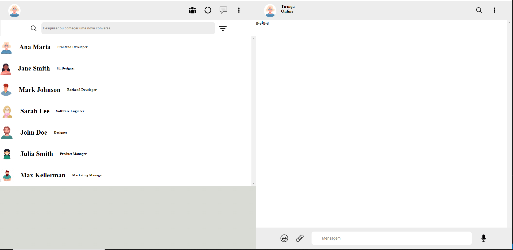
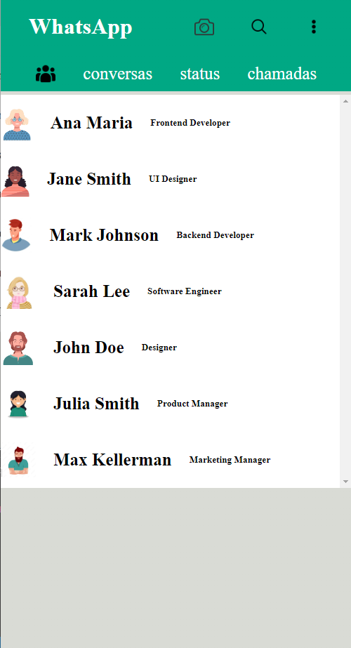

# DS2M - A -Guilherme Rufino
# Portifolio

para desktop 
 

para celular

# Sobre
Site do WhatsApp. O objetivo deste projeto é colocar em prática os conhecimentos adquiridos no curso do SENAI Jandira na criação de web sites e adquirir conhecimento sobre outras coisas das quais não foram abordadas no curso.

# Tecnologias
+ HTML
+ CSS
+ Responsividade
+ JS
+ Markdown
+ JSON

## [Clique aqui](https://github.com/rufinoguilherme633?) para acessar o meu gitHub

