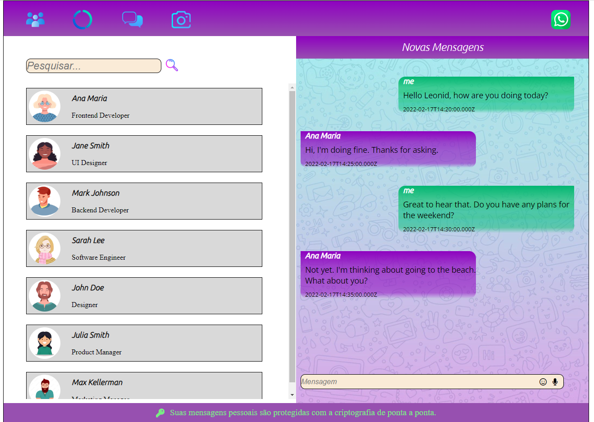

# Projeto_WhatsApp

## Objetivo:

Realizar a elaboração de uma interface semelhante ão WhatsApp utilizando : HTML, CSS e JAVASCRIPT.
E criar uma interface de usuário que seja intuitiva e agradável de usar, de forma a facilitar a comunicação entre os funcionários da empresa e aumentar a produtividade da equipe.

---

### Critérios da avaliação:

- [S] `Codificou o app conforme o original?`
- [S] Nomeou as classes CSS utilizando o padrão BEM?
- [S] `O app está responsivo?`
- [N] Utilizou algum framework CSS?
- [S] `Consumiu o JSON para mostrar todos os contatos?`
- [N] Criou outros itens, na lista de contatos, como a quantidade de mensagens lidas?
- [S] `Consumiu o JSON para mostrar as mensagens de cada contato?`
- [S] Foi criado variáveis pensando nas boas praticas?
- [S] `Foi criado funções pensando em responsabilidade única?`
- [S] `Foi criado funções pensando no principio de funções puras?`
- [S] O texto do README é objetivo e sucinto?
- [S] O screenshot mostra um pouco do projeto?
- [S] Existe um link para o github page no README?
- [S] Existe um link do autor do projeto no README?
- [S] `Fez a autoavaliação?`
  
> *Os textos em destaque são critérios críticos, ou seja, precisam ser atingidos.*  
> *Os demais, são critérios desejáveis, não necessários para aprovação, mas importantes para se destacar entre os demais desenvolvedores.* ]

---
### Link para o github: https://gustavohenriqueprojects.github.io/Projeto_WhatsApp/
### Link para o autor do projeto: https://github.com/GustavoHenriqueProjects
