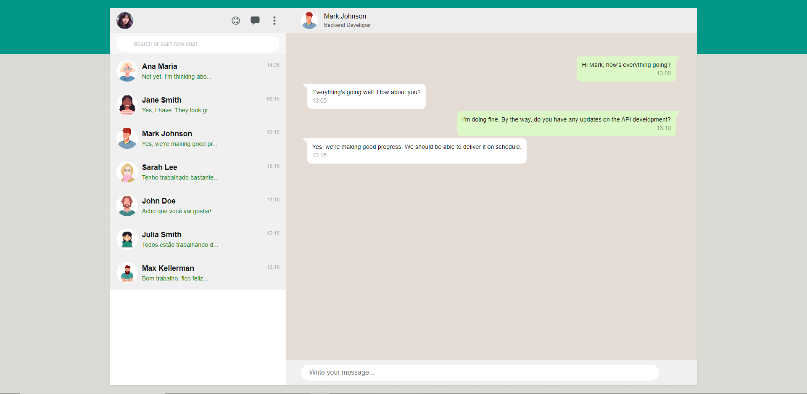
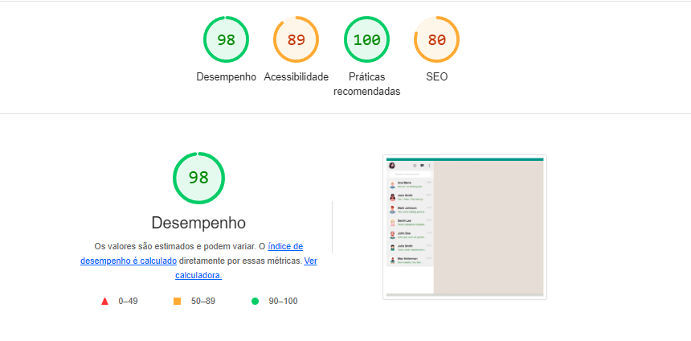

# WhatsApp Clone

[Clique aqui](https://ingryd16.github.io/whatsApp-senai-1-2023/ds2m/ingryd_shirlley_da_silva_ribeiro/) para conhecer o site

## Sobre
Site feito para desenvolver a interface do usuário de um projeto de chat interno para uma empresa. A empresa decidiu que a interface deverá ser um clone do WhatsApp, pois a grande maioria dos funcionários já está acostumada a utilizá-lo em seu dia a dia. O objetivo deste projeto é colocar em prática os conhecimentos adquiridos em aula no curso de Desenvolvimento de Sistemas do SENAI Jandira.

## LightHouse

## Critérios de Avaliação
[X]Codificou o app conforme o original? 
[X]Nomeou as classes CSS utilizando o padrão BEM? 
[X]O app está responsivo? 
[ ]Utilizou algum framework CSS? 
[X]Consumiu o JSON para mostrar todos os contatos? 
[ ]Criou outros itens, na lista de contatos, como a quantidade de mensagens lidas? 
[X]Consumiu o JSON para mostrar as mensagens de cada contato? 
[X]Foi criado variáveis pensando nas boas praticas? 
[X]Foi criado funções pensando em responsabilidade única? 
[X]Foi criado funções pensando no principio de funções puras? 
[X]O texto do README é objetivo e sucinto? 
[X]O screenshot mostra um pouco do projeto? 
[X]Existe um link para o github page no README? 
[X]Existe um link do autor do projeto no README? 
[X]Fez a autoavaliação? 

## Tecnologias utilizadas 
- CSS3
- HTML5
- JavaScript

## Autora 

