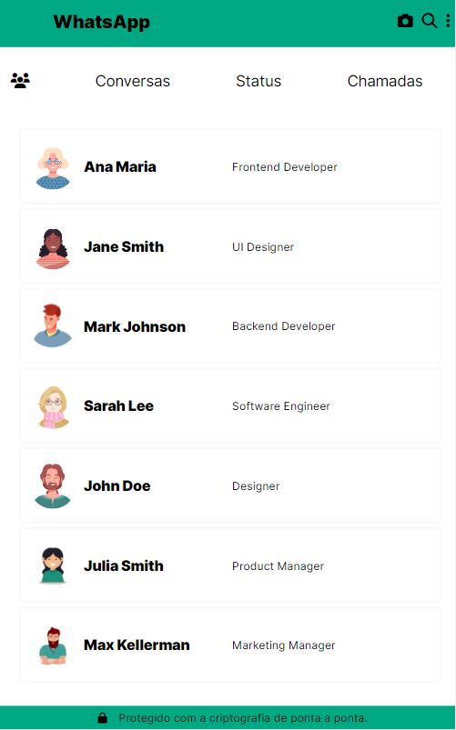
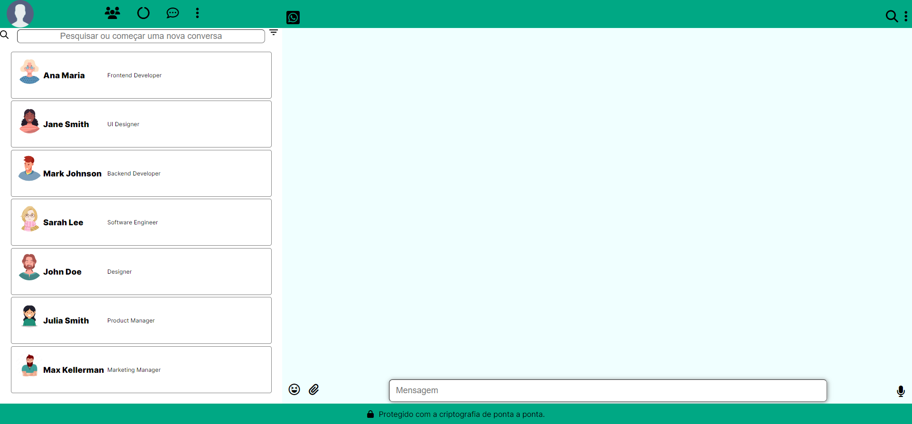

# WhatsApp

|      MOBILE         |          DESKTOP       |
|:-------------------:|:-----------------------:
|||
|                     |                        |

### [Clique aqui](https://leticia-evelin.github.io/whatsApp-senai-1-2023/ds2m/let%C3%ADcia_evelin_aguiar_e_silva/) para acessar o site!
---

## Sobre 
Site do tipo WhatsApp. O objetivo deste projeto é colocar em prática os conhecimentos sobre desenvolvimento de sites, no módulo de PWFE (Programação Web FrontEnd) adquiridos no curso do [SENAI Jandira](https://jandira.sp.senai.br/) e adquirir conteúdos que não foram abordados em aula.

## Tecnologias utilizadas
- CSS
- JSON
- HTML
- Markdown
- JavaScript
- Responsividade

## Autor 
- [Letícia Evelin](https://github.com/leticia-evelin)
# Critérios de Avaliação
- [x] `Codificou o app conforme o original?`
- [x] Nomeou as classes CSS utilizando o padrão BEM?
- [x] `O app está responsivo?`
- [ ] Utilizou algum framework CSS?
- [x] `Consumiu o JSON para mostrar todos os contatos?`
- [ ] Criou outros itens, na lista de contatos, como a quantidade de mensagens lidas?
- [x] `Consumiu o JSON para mostrar as mensagens de cada contato?`
- [x] Foi criado variáveis pensando nas boas praticas?
- [x] `Foi criado funções pensando em responsabilidade única?`
- [x] `Foi criado funções pensando no principio de funções puras?`
- [x] O texto do README é objetivo e sucinto?
- [x] O screenshot mostra um pouco do projeto?
- [x] Existe um link para o github page no README?
- [x] Existe um link do autor do projeto no README?
- [x] `Fez a autoavaliação?`