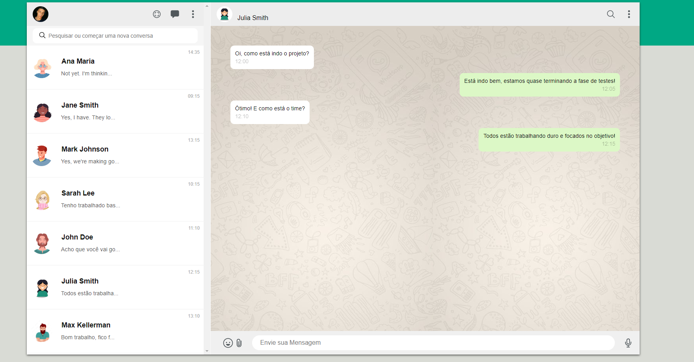
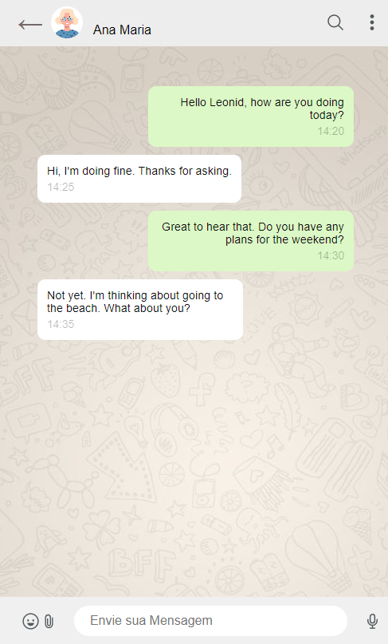

# Autor: ['Anderson Reis'](https://github.com/Andersoreeis)

# Link da Página: [Link](andersoreeis.github.io/whatsapp-web/)
# Critérios de Avaliação
- [x] `Codificou o app conforme o original?`
- [ ] Nomeou as classes CSS utilizando o padrão BEM?
- [x] `O app está responsivo?`
- [ ] Utilizou algum framework CSS?
- [x] `Consumiu o JSON para mostrar todos os contatos?`
- [x] Criou outros itens, na lista de contatos, como a quantidade de mensagens lidas?
- [x] `Consumiu o JSON para mostrar as mensagens de cada contato?`
- [x] Foi criado variáveis pensando nas boas praticas?
- [x] `Foi criado funções pensando em responsabilidade única?`
- [ ] `Foi criado funções pensando no principio de funções puras?`
- [x] O texto do README é objetivo e sucinto?
- [x] O screenshot mostra um pouco do projeto?
- [x] Existe um link para o github page no README?
- [x] Existe um link do autor do projeto no README?
- [x] `Fez a autoavaliação?`