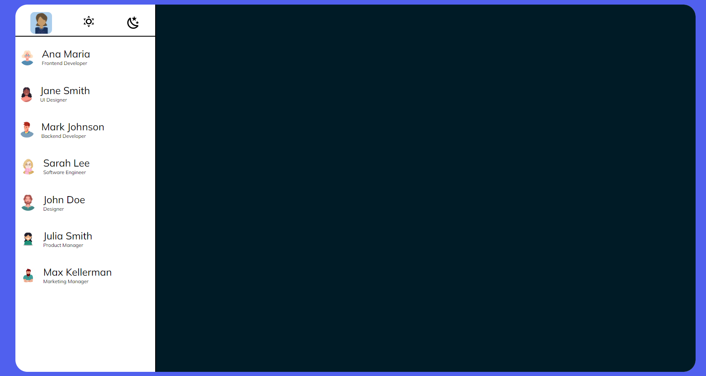
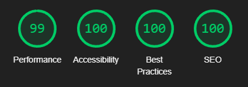

# EmpresarialCHat

[link do projeto](https://github.com/AndreLuisConstantino/whatsApp-senai-somativa)

## Critérios de Avaliação

[X]Codificou o app conforme o original? 
[x]Nomeou as classes CSS utilizando o padrão BEM? 
[X] O app está responsivo? 
[X] Utilizou algum framework CSS? 
[X] Consumiu o JSON para mostrar todos os contatos? 
[X] Criou outros itens, na lista de contatos, como a quantidade de mensagens lidas? 
[X] Consumiu o JSON para mostrar as mensagens de cada contato? 
[X] Foi criado variáveis pensando nas boas praticas? 
[X] Foi criado funções pensando em responsabilidade única? 
[X] Foi criado funções pensando no principio de funções puras? 
[X] O texto do README é objetivo e sucinto? 
[X]O screenshot mostra um pouco do projeto? 
[X] Existe um link para o github page no README? 
[X] Existe um link do autor do projeto no README? 
[X]Fez a autoavaliação? 

## LightHouse

## Tecnologias utilizadas 

- HTML
- CSS
- JavaScript
- JSON

## Autor
Meu nome é André Luiz e sou estudante de desenvolvimento de sistemas no SENAI Jandira. Eu tenho grande interesse em desenvolvimento web e fiquei muito feliz em participar do projeto clone do WhatsApp Web proposto pelo professor Fernando Leonid. Se quiser conferir meus outros projetos, fique à vontade para acessar meu perfil no GitHub: [AndreLuis](https://github.com/AndreLuisConstantino)
