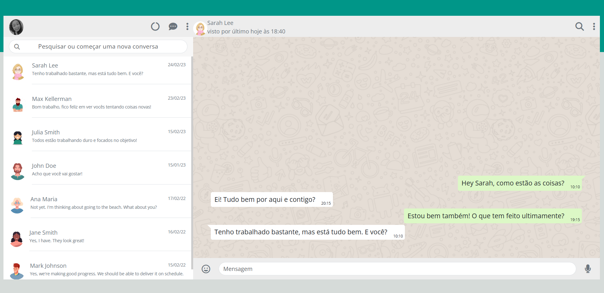

# WhatsApp Web Clone 

[link do projeto](https://leaobia.github.io/whatsApp-senai-1-2023/ds2t/bianca_pereira_le%C3%A3o/#)

## Critérios de Avaliação
[X]Codificou o app conforme o original?
[]Nomeou as classes CSS utilizando o padrão BEM?
[X] O app está responsivo?
[X] Utilizou algum framework CSS?
[X] Consumiu o JSON para mostrar todos os contatos?
[X] Criou outros itens, na lista de contatos, como a quantidade de mensagens lidas?
[X] Consumiu o JSON para mostrar as mensagens de cada contato?
[X] Foi criado variáveis pensando nas boas praticas?
[X] Foi criado funções pensando em responsabilidade única?
[X] Foi criado funções pensando no principio de funções puras?
[X] O texto do README é objetivo e sucinto?
[X]O screenshot mostra um pouco do projeto?
[X] Existe um link para o github page no README?
[X] Existe um link do autor do projeto no README?
[X]Fez a autoavaliação?

## Autora 
Meu nome é Bianca Leão e sou estudante de desenvolvimento de sistemas no SENAI Jandira. Eu tenho grande interesse em desenvolvimento web e fiquei muito feliz em participar do projeto clone do WhatsApp Web proposto pelo professor Fernando Leonid. Se quiser conferir meus outros projetos, fique à vontade para acessar meu perfil no GitHub: [biancaLeao](https://github.com/leaobia)