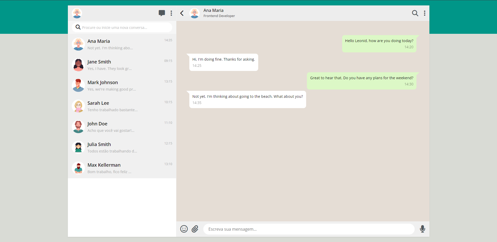

# Whatsapp

---

## Sobre
Site criado pensando em uma copia do Whatsapp Web.

O objetivo deste projeto é colocar em prática os conhecimentos adquiridos em aula no curso de Desenvolvimento de Sistemas do [SENAI Jandira](https://jandira.sp.senai.br/).

---
## Tecnologias utilizadas
- Figma
- HTML5
- CSS3
- JS
- Markdown
- JSON

---
## Autor
- [Cauã Felipe](https://github.com/alemao148)

---
## Links
- [Github](https://alemao148.github.io/whatsApp-senai-1-2023/ds2t/caua_felipe_guerra_de_souza/index.html)

# Critérios de Avaliação
- [x] `Codificou o app conforme o original?`
- [X] Nomeou as classes CSS utilizando o padrão BEM?
- [x] `O app está responsivo?`
- [ ] Utilizou algum framework CSS?
- [x] `Consumiu o JSON para mostrar todos os contatos?`
- [ ] Criou outros itens, na lista de contatos, como a quantidade de mensagens lidas?
- [x] `Consumiu o JSON para mostrar as mensagens de cada contato?`
- [x] Foi criado variáveis pensando nas boas praticas?
- [x] `Foi criado funções pensando em responsabilidade única?`
- [x] `Foi criado funções pensando no principio de funções puras?`
- [x] O texto do README é objetivo e sucinto?
- [x] O screenshot mostra um pouco do projeto?
- [x] Existe um link para o github page no README?
- [x] Existe um link do autor do projeto no README?
- [x] `Fez a autoavaliação?`
