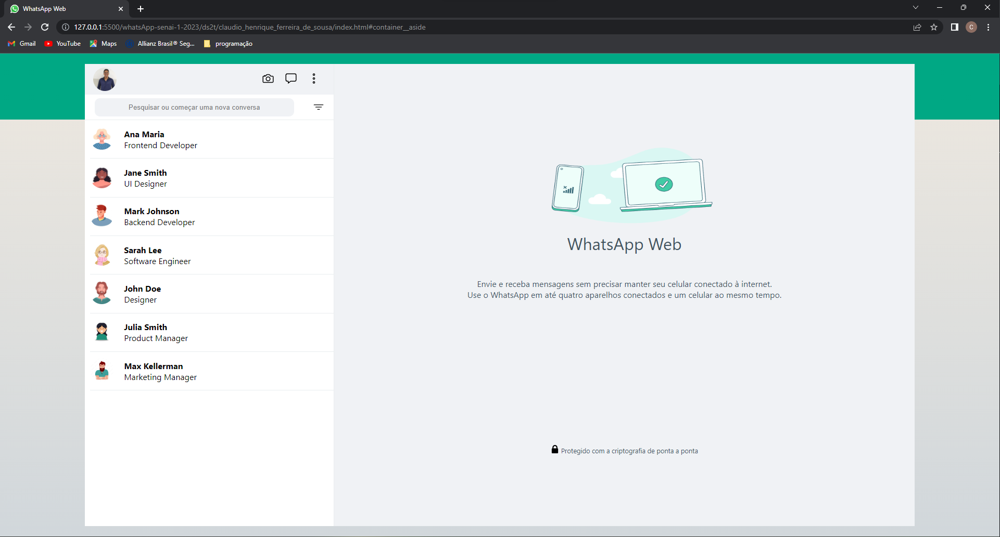

# Clone WhatsApp Web

[Projeto](https://github.com/ClaudioSousa44/whatsApp-senai-1-2023.git)

# Sobre

Projeto com a proposta de realizar um clone do WhatsApp Web como avaliação somativa.
O intuito era colocar em prática os conhecimentos adquiridos em sala, consumindo um JSON feito pelo professor!

# Tecnologia utilizada

- HTML5
- CSS3
- JavaScript (consumir JSON)
- Markdown
- Responsividade

# Autor

- [Claudio Sousa](https://github.com/ClaudioSousa44)