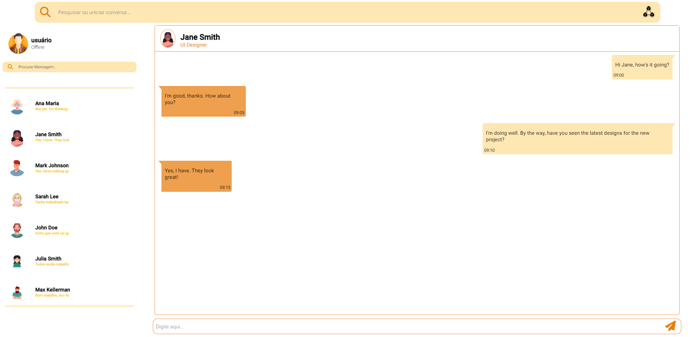

# WhatsApp Web Clone 

> Segue o link para o _[Prótotipo Figma](https://www.figma.com/file/ekgsYueRFnufsFVZERk904/WhatsApp-2.0?node-id=0-1&t=BtvBXRvhzTSBroov-0)_

## Objetivo
 Desenvolver habilidades lidando com arquivo **JSON** e seus objetos. O intuito Nesse Projeto é de carregar os contatos existentes no **JSON**, e com o evento de clique mostrar suas respectivas mensagens.  

## Critérios de avaliação

- [X] Codificou o app conforme o original?
- [ ] Nomeou as classes CSS utilizando o padrão BEM?
- [X] O app está responsivo?
- [ ] Utilizou algum framework CSS?
- [X] Consumiu o JSON para mostrar todos os contatos?
- [X] Criou outros itens, na lista de contatos, como a quantidade de mensagens lidas?
- [X] Consumiu o JSON para mostrar as mensagens de cada contato?
- [X] Foi criado variáveis pensando nas boas praticas?
- [X] Foi criado funções pensando em responsabilidade única?
- [X] Foi criado funções pensando no principio de funções puras?
- [X] O texto do README é objetivo e sucinto?
- [X] O screenshot mostra um pouco do projeto?
- [X] Existe um link para o github page no README?
- [X] Existe um link do autor do projeto no README?
- [X] Fez a autoavaliação?

## Tecnologias Utilizadas

* HTML 
* CSS
* JavaScript
* JSON

## Autora
***[Daniela Lino](https://github.com/D4kii)***