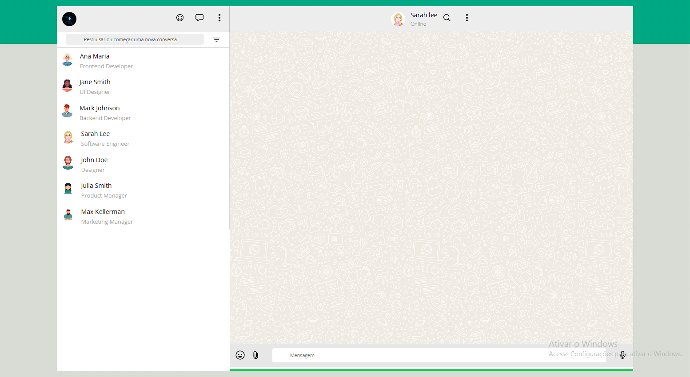

          DESKTOP       |

|

## Link do Site
https://ratinho253.github.io/site-zap/
---
## Sobre 

- Site do WhatsApp. O objetivo deste projeto é colocar em prática os conhecimentos adquiridos no curso do SENAI Jandira na criação de web sites e adquirir conhecimento sobre outras coisas das quais não foram abordadas no curso.

## Tecnologias utilizadas 
- HTML
- CSS
- Java Script
- Markdown
- Responsividade

## Ferramentas
- WhatsApp Web
- Ionicons
- Visual Studio Code

## Autor
 João Victor da Silva
