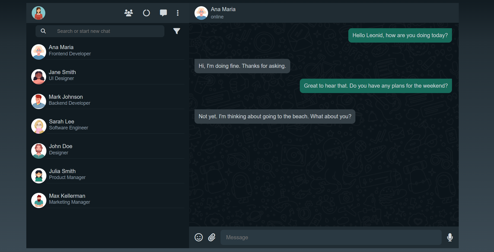

# WhatsApp - Somativa

------
## Sobre
O objetivo deste projeto de avaliação somativa é colocar em prática os conhecimentos sobre JSON adquiridos no curso de Desenvolvimento de Sistemas do [SENAI Jandira](https://jandira.sp.senai.br/).

-----
## Tecnologias ultilizadas
- HTML
- CSS
- Markdown
- Responsividade
- Percorrer JSON

------

## Critérios de Avaliação
- [ ] `Codificou o app conforme o original?`
- [ ] Nomeou as classes CSS utilizando o padrão BEM?
- [ ] `O app está responsivo?`
- [ ] Utilizou algum framework CSS?
- [ ] `Consumiu o JSON para mostrar todos os contatos?`
- [ ] Criou outros itens, na lista de contatos, como a quantidade de mensagens lidas?
- [ ] `Consumiu o JSON para mostrar as mensagens de cada contato?`
- [ ] Foi criado variáveis pensando nas boas praticas?
- [ ] `Foi criado funções pensando em responsabilidade única?`
- [ ] `Foi criado funções pensando no principio de funções puras?`
- [ ] O texto do README é objetivo e sucinto?
- [ ] O screenshot mostra um pouco do projeto?
- [ ] Existe um link para o github page no README?
- [ ] Existe um link do autor do projeto no README?
- [ ] `Fez a autoavaliação?`
  
> *Os textos em destaque são critérios críticos, ou seja, precisam ser atingidos.*  
> *Os demais, são critérios desejáveis, não necessários para aprovação, mas importantes para se destacar entre os demais desenvolvedores.*

-----
## Figma

Projeto inspirado no [Figma.](https://www.figma.com/file/x3IgYfV68XfqmIvByoZ43E/WhatsApp-somativa?node-id=0%3A1&t=pDvrDXsRZHpPceqy-0)

----- 
## Autor

[Julia Soares.](https://github.com/Xul14)
