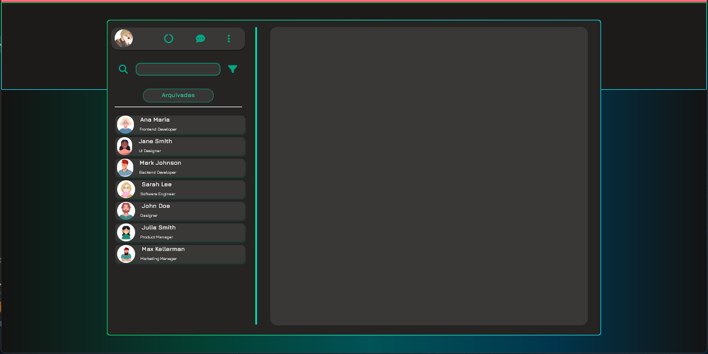
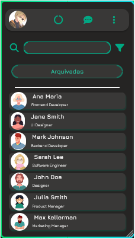
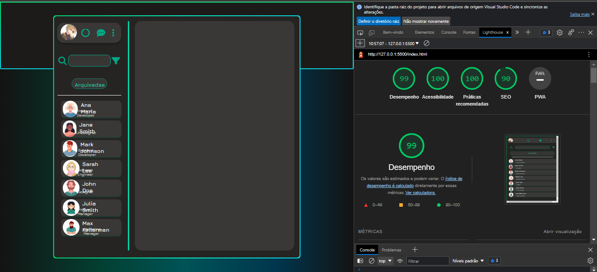

# WhatsApp - MiZap

## Desktop

## Mobile

---

## Links

- GitHub Repositório: [Clique aqui!](https://github.com/marcelo-g-v-s/whatsApp-senai-1-2023/tree/marcelo)

- GitHub Pages: [Clique aqui!](https://marcelo-g-v-s.github.io/whatsApp-senai-1-2023/ds2t/marcelo_gabriel_vieira_santiago/)

---

## Sobre o Projeto

 O site foi desenvolvido com o intuito de ser uma atividade somativa para a disciplica Web Front-End do Senai.

 O Objetivo era familiarizar os alunos com o novo conteúdo ensinado, entre eles JavaScript e Array.

 O tema do site foi desenvolver um WhatsApp Web Front-End, podendo clonar o original ou planejar um original.

 ---

 ## Tecnologias Utilizadas
- HTML5
- CSS3
- Responsividade
- IonIcons
- JS
- Figma
- Markdown
- JSon

---

## Relatório Lighthouse

---

## Protótipo

Antes de realizar qualquer etapa de código, o planejamento foi essencial.

O design da página foi desenvolvido no Figma.

- [Clique aqui e veja o design!](https://www.figma.com/file/kIqzoLCyXf6W7KFIzDBLdW/Projeto-Whatsapp?node-id=0-1&t=rtyTGPrHQhtUACF0-0)

---

## Tasks Planejadas

- [x] Inicio: Começo - Organização
- [x] Task Desenvolvimento 
- [x] Task Funcionalidades
- [x] Task Responsividade
- [x] Task ReadMe
- [x] Task Finalização Extra 1.0*

Obs: * A Task Finalização Extra é para futuros avanços e correções de bugs.

---

## Autoavaliação

- [x] `Codificou o app conforme o original?`
- [x] Nomeou as classes CSS utilizando o padrão BEM?
- [x] `O app está responsivo?`
- [ ] Utilizou algum framework CSS?
- [x] `Consumiu o JSON para mostrar todos os contatos?`
- [ ] Criou outros itens, na lista de contatos, como a quantidade de mensagens lidas?
- [x] `Consumiu o JSON para mostrar as mensagens de cada contato?`
- [x] Foi criado variáveis pensando nas boas praticas?
- [x] `Foi criado funções pensando em responsabilidade única?`
- [x] `Foi criado funções pensando no principio de funções puras?`
- [x] O texto do README é objetivo e sucinto?
- [x] O screenshot mostra um pouco do projeto?
- [x] Existe um link para o github page no README?
- [x] Existe um link do autor do projeto no README?
- [x] `Fez a autoavaliação?`

---

## Autor

- [Marcelo Gabriel](https://github.com/marcelo-g-v-s)