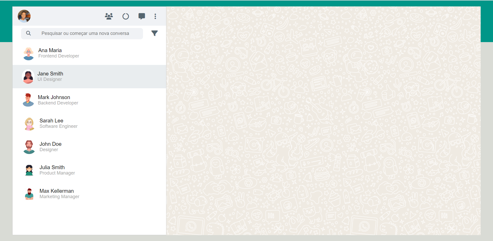

# Whatsapp Web

[Clique aqui](https://github.com/MateusAlves595/whatsApp-senai-1-2023) para acessar o site.
---
## Sobre
Site com o objetivo de ser um clone do Whatsapp Web.
O objetivo deste projeto é colocar em prática os conhecimentos, sobre o desenvolvimento de sites e integração de javaScript, adquiridos no curso do [SENAI Jandira](https://jandira.sp.senai.br/).
---

## Tecnologia utilizada
- HTML5
- CSS3
- Responsividade
- JavaScript

---
## Autor
- [Mateus Alves](https://github.com/MateusAlves595)
