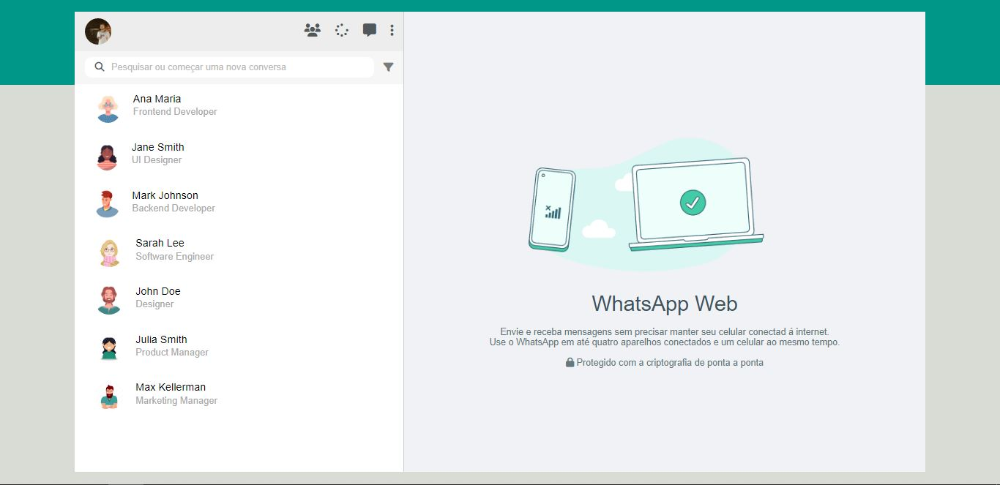

# WhatsApp Web

[Clique aqui](https://github.com/MatheusAlves099/whatsApp-senai-1-2023/tree/matheusReis/ds2t/matheus_alves_reis_da_silva)

[Link - Github Page](https://matheusalves099.github.io/WhatsAppWeb/)

# Sobre

Projeto do tipo atividade somativa que tem como objetivo criar um clone do WhatsApp Web, utilizando HTML, CSS e Javascript. Deixando o mesmo responsivo e com mensagens e contatos vindo através de um arquivo JSON. Projeto realizado na escola [SENAI Jandira](https://jandira.sp.senai.br/) no curso técnico de Desenvolvimento de Sistemas (2º Semestre).

# Critérios de Avaliação

- [X] `Codificou o app conforme o original?`
- [ ] Nomeou as classes CSS utilizando o padrão BEM?
- [X] `O app está responsivo?`
- [ ] Utilizou algum framework CSS?
- [X] `Consumiu o JSON para mostrar todos os contatos?`
- [ ] Criou outros itens, na lista de contatos, como a quantidade de mensagens lidas?
- [X] `Consumiu o JSON para mostrar as mensagens de cada contato?`
- [ ] Foi criado variáveis pensando nas boas praticas?
- [X] `Foi criado funções pensando em responsabilidade única?`
- [X] `Foi criado funções pensando no principio de funções puras?`
- [X] O texto do README é objetivo e sucinto?
- [X] O screenshot mostra um pouco do projeto?
- [X] Existe um link para o github page no README?
- [X] Existe um link do autor do projeto no README?
- [X] `Fez a autoavaliação?`

# Tecnologia utilizada 

- HTML5
- CSS3
- JavaScript
- Responsividade
- Markdown  
- JSON

# Autor 

- [Matheus Alves Reis da Silva](https://github.com/MatheusAlves099)
