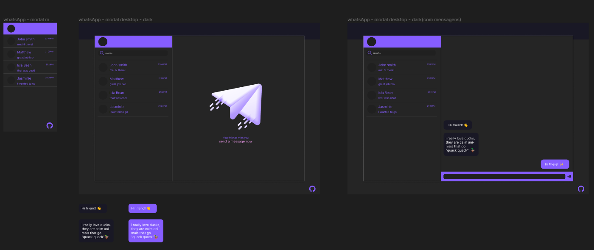

## WhatsApp - nova versão

Projeto criado como atividade somativa para as aulas de PWFE. O objetivo é consumir um arquivo json para carregar todos os contatos.

## Protótipo Figma

O projeto inicialmente conta com apenas uma versão de tema dark nos tons preto e variações de roxo.

## Link do Projeto

Confira o [projeto](https://nicanico.github.io/whatsApp-senai-1-2023/ds2t/nicole_souza_santos/#chatMensagens) na web.

## Auto-avaliação

- [X] Codificou o app conforme o original?
- [ ] Nomeou as classes CSS utilizando o padrão BEM?
- [X] O app está responsivo?
- [X] Utilizou algum framework CSS?
- [X] Consumiu o JSON para mostrar todos os contatos?
- [ ] Criou outros itens, na lista de contatos, como a quantidade de mensagens lidas?
- [X] Consumiu o JSON para mostrar as mensagens de cada contato?
- [X] Foi criado variáveis pensando nas boas praticas?
- [X] Foi criado funções pensando em responsabilidade única?
- [X] Foi criado funções pensando no principio de funções puras?
- [X] O texto do README é objetivo e sucinto?
- [X] O screenshot mostra um pouco do projeto?
- [X] Existe um link para o github page no README?
- [X] Existe um link do autor do projeto no README?
- [X] Fez a autoavaliação?

## status e data de entrega

> Entrega: 02/03

> Status do projeto: Concluido - tendo ajustes ✔️

## Autor(a)

[Nicole Souza](https://github.com/nicanico)
