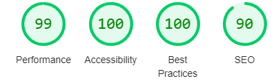

# WhatsApp Web

[Link do Projeto]()

## Critérios de Avaliação

[X]Codificou o app conforme o original? 
[ ]Nomeou as classes CSS utilizando o padrão BEM? 
[X] O app está responsivo? 
[ ] Utilizou algum framework CSS? 
[X] Consumiu o JSON para mostrar todos os contatos? 
[X] Criou outros itens, na lista de contatos, como a quantidade de mensagens lidas? 
[X] Consumiu o JSON para mostrar as mensagens de cada contato? 
[X] Foi criado variáveis pensando nas boas praticas? 
[X] Foi criado funções pensando em responsabilidade única? 
[X] Foi criado funções pensando no principio de funções puras? 
[X] O texto do README é objetivo e sucinto? 
[X] O screenshot mostra um pouco do projeto? 
[X] Existe um link para o github page no README? 
[X] Existe um link do autor do projeto no README? 
[X] Fez a autoavaliação? 

## LightHouse

## Tecnologias utilizadas 

- HTML
- CSS
- JavaScript

## Autor
[Oswaldo Barbosa](https://www.linkedin.com/in/oswaldo-barbosa-265115242/)