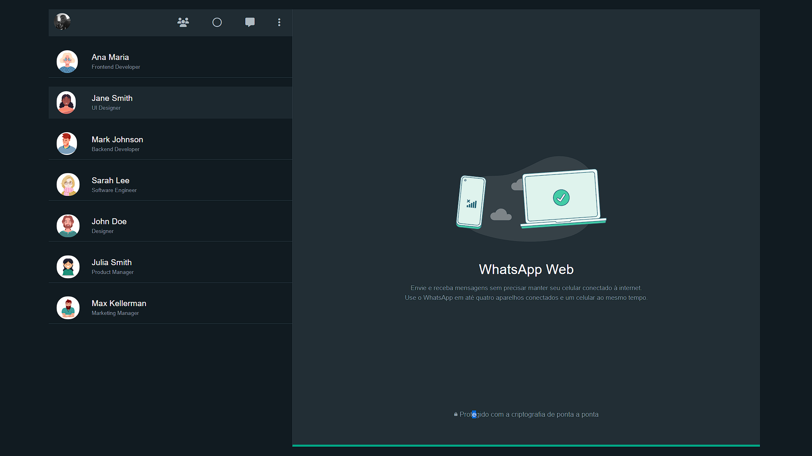

# WhatsApp Web

[Link do Projeto](https://oswaldbarbosa.github.io/whatsApp-senai-1-2023/ds2t/oswaldo_da_silva_barbosa_dos_santos)

# Sobre

Projeto com a proposta de realizar um clone do WhatsApp Web como avaliação somativa.
O intuito era colocar em prática os conhecimentos adquiridos em sala, consumindo um JSON feito pelo professor!

# Autoavaliação

- [X] `Codificou o app conforme o original?`
- [X]  Nomeou as classes CSS utilizando o padrão BEM?
- [X] `O app está responsivo?`
- [ ]  Utilizou algum framework CSS?
- [X] `Consumiu o JSON para mostrar todos os contatos?`
- [ ]  Criou outros itens, na lista de contatos, como a quantidade de mensagens lidas?
- [X] `Consumiu o JSON para mostrar as mensagens de cada contato?`
- [x]  Foi criado variáveis pensando nas boas praticas?
- [X] `Foi criado funções pensando em responsabilidade única?`
- [X] `Foi criado funções pensando no principio de funções puras?`
- [X] O texto do README é objetivo e sucinto?
- [X] O screenshot mostra um pouco do projeto?
- [X] Existe um link para o github page no README?
- [X] Existe um link do autor do projeto no README?
- [X] `Fez a autoavaliação?`

# LightHouse

# Tecnologia utilizada

- HTML
- CSS
- JavaScript

# Autor

- [Oswaldo Barbosa]()