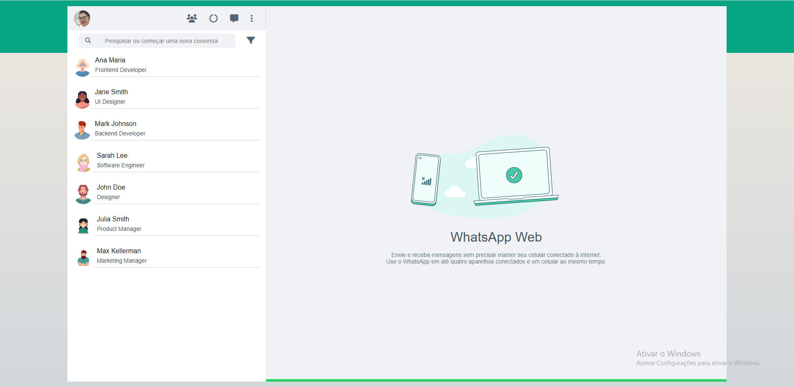

# WhatsApp Web

[Clique aqui](https://github.com/Thiago1223/whatsApp-senai-1-2023)

# Sobre

Projeto de somativa com o intuíto de criar um clone do WhatsApp Web.
O objetivo deste projeto é colocar em prática os conhecimentos, sobre o desenvolvimento de sites e consumo de JSON adquiridos no curso do [SENAI Jandira](https://jandira.sp.senai.br/).

# Critérios de Avaliação

- [X] `Codificou o app conforme o original?`
- [ ] Nomeou as classes CSS utilizando o padrão BEM?
- [X] `O app está responsivo?`
- [ ] Utilizou algum framework CSS?
- [X] `Consumiu o JSON para mostrar todos os contatos?`
- [ ] Criou outros itens, na lista de contatos, como a quantidade de mensagens lidas?
- [X] `Consumiu o JSON para mostrar as mensagens de cada contato?`
- [ ] Foi criado variáveis pensando nas boas praticas?
- [X] `Foi criado funções pensando em responsabilidade única?`
- [X] `Foi criado funções pensando no principio de funções puras?`
- [X] O texto do README é objetivo e sucinto?
- [X] O screenshot mostra um pouco do projeto?
- [X] Existe um link para o github page no README?
- [X] Existe um link do autor do projeto no README?
- [X] `Fez a autoavaliação?`

# Tecnologia utilizada 

- HTML5
- CSS3
- JavaScript
- Responsividade
- Markdown  
- JSON

# Autor 

- [Thiago Freitas](https://github.com/Thiago1223)
