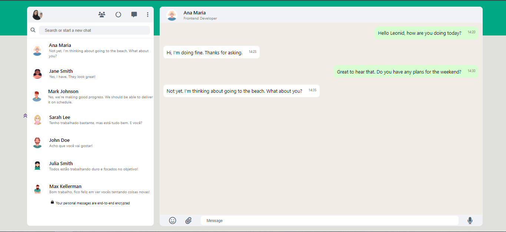

# Clone - WhatsApp Web

[Clique aqui para acessar o site.](https://yasmingcv.github.io/whatsApp-senai-1-2023/ds2t/yasmin_goncalves_coelho/)

---
Projeto realizado para a aula de **Programação Web Front End**. Esse é um clone do site do [Whatsapp Web](https://web.whatsapp.com/) para colocar em prática os conhecimentos obtidos em aula até o momento.

---
## Tecnologias utilizadas:
- HTML5
- CSS3
- JavaScript
- JSON
- Responsividade

---

## Autora
[Yasmin Gonçalves](https://github.com/yasmingcv)

---
## Critérios de Avaliação
- [ x ] `Codificou o app conforme o original?`
- [ x ] Nomeou as classes CSS utilizando o padrão BEM?
- [ x ] `O app está responsivo?`
- [ ] Utilizou algum framework CSS?
- [ x ] `Consumiu o JSON para mostrar todos os contatos?`
- [ ] Criou outros itens, na lista de contatos, como a quantidade de mensagens lidas?
- [ x ] `Consumiu o JSON para mostrar as mensagens de cada contato?`
- [ x ] Foi criado variáveis pensando nas boas praticas?
- [ x ] `Foi criado funções pensando em responsabilidade única?`
- [ x ] `Foi criado funções pensando no principio de funções puras?`
- [ x ] O texto do README é objetivo e sucinto?
- [ x ] O screenshot mostra um pouco do projeto?
- [ x ] Existe um link para o github page no README?
- [ x ] Existe um link do autor do projeto no README?
- [ x ] `Fez a autoavaliação?`
